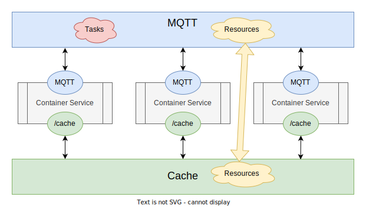
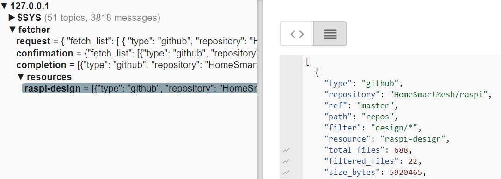

# Copper
The basic material for creating pipelines

colelction of containers utilities providing services for websites and data management



# Usage
```bash
cd services
docker compose up
```

* test with a publish on the topic `fetcher/request`

```json
{
    "fetch_list": [
        {
            "type": "github",
            "repository":   "HomeSmartMesh/raspi",
            "ref":  "master",
            "path": "repos",
            "filter":   "design/*",
            "resource": "raspi-design"
        }
    ]
}
```

* the fetcher publishes on confirmation then on completion and on resources



# Concept

## service structure
a service consists of
* a docker container as a Dockerfile or folder
* an mqtt client
    * subscribes to services endpoints for requests
    * publishes to services status and completion
    * subscribes to resources triggers as input
    * publishes on resources generation as output
* optionally for bootstrapping a MANIFEST environemnt variable can be passed to use a local file

## content locations
* a core service within copper
* a local repo service
* a remote url service

## visualization
* collection of mosquitto logs allows to trace services publish and subscribe to generate a dependencies graph

## Events vs REST
two types of corss services interactions will be used :
* Event based
    * suitable for long running jobs
    * single instance
    * central MQTT broker

    A slow interaction is an an operation that
    * can require a long time to process such as more than 30s or minutes or hours.
    * is only initiated by a single service client
    * requests do not need to be queued
    * is needed sporadically or scheduled with jobs which preiod is necessarily bigger if not significantly bigger than the time it takes them to complete

* REST API
    * suitable for fast running jobs
    * multiple instances of independent clients
    * http REST API

    A fat interaction is an an operation that
    * completes necessarily within less any default request timeout config
    * can be initiated by any number of independent clients
    * requests need to be queued
    * is needed very frequently such as converting a high number of files


# TODOs
* remove PyYaml could not isntall on windows and dependabot alert
* make filter optional and support glob variant
